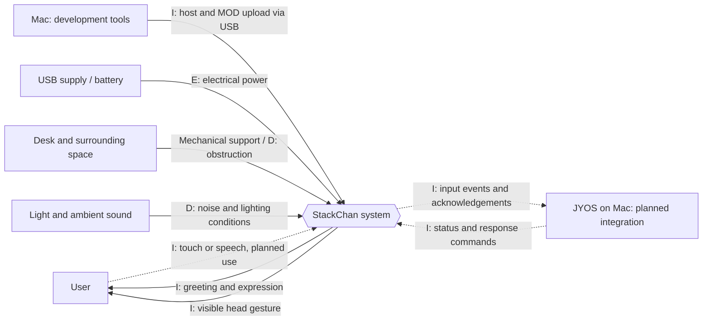
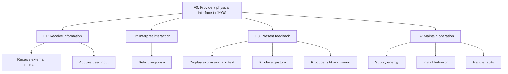
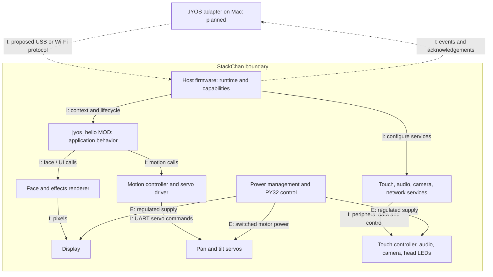
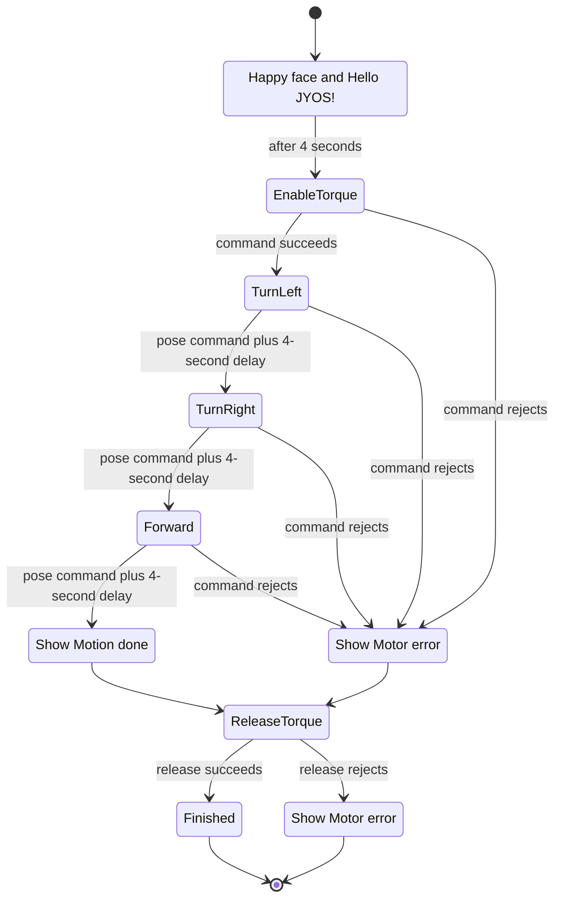
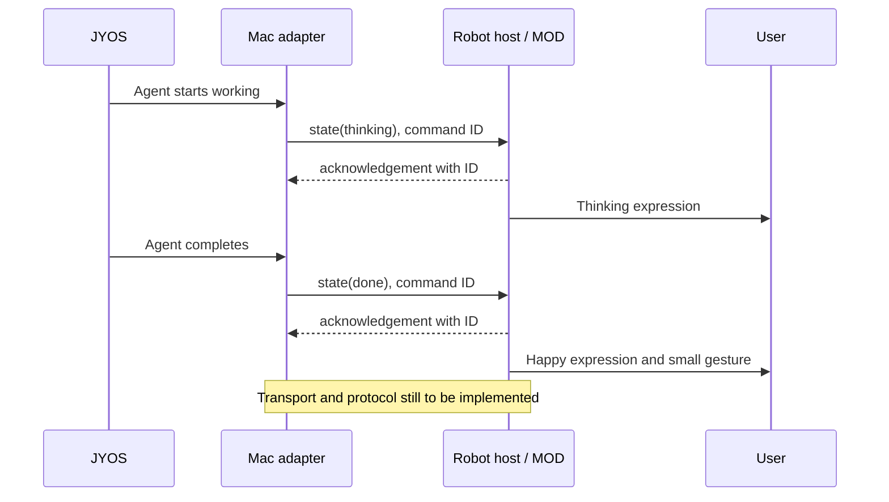
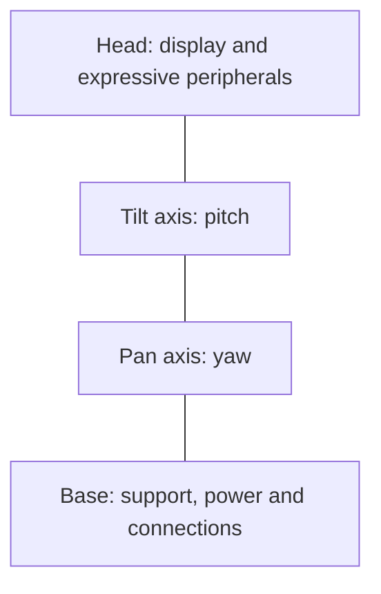

# JYOS StackChan system model

Version 0.1 · 2026-10-03 · M5StackChan CoreS3 · community host v1.1.0

> Historical greeting-stage baseline. Status labels below refer to this checkpoint. Research status, on-device face detection, spoken completion and automatic clearing were subsequently delivered. See the [current architecture](../../../knowledge_base/architecture.md) and [research feature specification](../../../knowledge_base/feat/research-companion/feature.md). Two-way acknowledgement and conversation remain proposed.

A compact **CONSENS-inspired** model expressed in Markdown and Mermaid. These diagrams adapt the notation for readability; they are not formal CONSENS or SysML interchange files.

**System boundary:** the physical robot and its firmware. The Mac, JYOS, network, and optional AI services are external systems. JYOS architecture is a proposal, not an inspected implementation.

**Status:** **Verified** = observed on this robot; **Supported** = present in firmware/configuration but not tested here; **Planned** = proposed JYOS integration.

## 1. Objectives — why build it?

| ID | Objective | Success indicator |
| --- | --- | --- |
| O1 | Make JYOS activity perceptible | User distinguishes idle, thinking, and done |
| O2 | Enable simple physical interaction | A supported input produces a visible response |
| O3 | Keep experimentation quick | Behavior changes can be uploaded as a MOD |
| O4 | Provide an approachable companion | Greetings, expressions, and small gestures work together |

O3 and the greeting part of O4 are verified. O1 and O2 remain planned.

## 2. Environment — black-box view

Flows are labeled **I** information, **E** energy, and **D** disturbance. No intentional material transfer is modeled. Desk contact is mechanical support, not material flow. Dashed links denote planned interactions, not a CONSENS flow-style convention.

## 3. Application scenarios — what happens?

| ID | Trigger | Expected reaction | Status |
| --- | --- | --- | --- |
| S1 | Power-on or reboot | Show greeting; turn slightly both ways; return forward | Verified |
| S2 | Developer uploads a MOD | Verify archive, reboot, run new behavior | Verified |
| S3 | JYOS sends an agent state | Show corresponding expression or gesture | Planned |
| S4 | User taps a supported control | Send an event to JYOS and show feedback | Planned |
| S5 | User asks a spoken question | Capture audio; external service processes it; present answer | Planned |
| S6 | Connection or motor command fails | Show a clear status; handle failure without continued motion | Motor error path implemented, not fault-tested; connection behavior planned |

## 4. Requirements — measurable expectations

These are proposed project requirements, not manufacturer specifications.

| ID | Requirement | Verification | Status |
| --- | --- | --- | --- |
| R1 | Boot into the installed greeting MOD | Observe greeting after reset | Passed |
| R2 | Execute three small yaw poses and release torque afterward | Observe turns; inspect command sequence | Motion observed; torque release commanded, not independently measured |
| R3 | Update behavior without rebuilding the host | Install and verify a MOD archive | Passed |
| R4 | Represent idle, thinking, and done with distinct outputs | Send each state and observe output | Planned |
| R5 | Acknowledge valid JYOS commands with their command ID | Integration test matches request and acknowledgement | Planned |
| R6 | Indicate a lost JYOS connection within 5 seconds | Disconnect transport and time indication | Proposed target |
| R7 | Keep capture off until explicitly activated | Verify idle has no microphone/camera capture | Proposed design requirement |

## 5. Functions — solution-neutral decomposition

F31, F32, and F42 have been demonstrated. Other functions need integration or further verification.

## 6. Active structure — elements and their interactions

Software arrows carry information. Power arrows carry energy. Hardware details below come from the checked-out target configuration; audio, camera, LEDs, and touch have not been tested in this session.

The runtime executes on the ESP32-S3 using Moddable XS. The platform selects the dedicated `m5stackchan` servo driver, UART TX 6/RX 7 at 1 Mbaud, pan ID 1, tilt ID 2, and PY32 servo-power control. It configures 12 head LEDs. The diagram abstracts the exact power rails.

### Interface view

| Interface | Content / contract | Status |
| --- | --- | --- |
| Mac → robot, USB flashing | Host binaries or MOD archive; flash verification | Verified |
| Host → MOD | `onContextCreated(robot)` provides capabilities | Verified |
| MOD → UI | `setEmotion()`, `addEffect()`, `removeEffect()` | Verified |
| MOD → motion | `setTorque()`, `setPose()`; radians and seconds | Verified |
| Controller → servos | UART commands and replies via driver | Movement verified |
| JYOS ↔ host/adapter | Transport, framing, command IDs, acknowledgements, reconnect behavior | Not yet designed |

First proposed application message: `{"id":"42","type":"state","value":"thinking"}`. This is a design sketch, **not** an existing firmware API. Select one transport and document its framing before implementation. USB flashing access does not itself establish a JYOS application connection.

## 7. Behavior — current and future

### Current greeting MOD

Yaw commands are `+0.15`, `-0.15`, and `0` radians, each with a one-second requested duration. Completion acknowledges the command, not independently measured arrival. `lookAt()` has a 30° gaze threshold, so this MOD uses direct poses. Left/right naming is conceptual; physical direction follows the driver convention.

### Planned JYOS status interaction

## 8. Shape — physical arrangement reference

This is a logical arrangement, not a dimensioned drawing or CAD model.

Preserve the existing enclosure and leave clearance for head rotation. Exact dimensions, mass, axis limits, and center of gravity remain unmeasured. Use vendor CAD/mechanical documentation before changing the enclosure.

## 9. Traceability and SysML correspondence

| Objective → scenario → requirement | Function | Realization / verification |
| --- | --- | --- |
| O4 → S1 → R1 | F31 | MOD + UI; greeting observed |
| O4 → S1 → R2 | F32 | MOD + servo driver; small motion observed |
| O3 → S2 → R3 | F42 | npm MOD workflow; verified upload |
| O1 → S3 → R4/R5 | F11/F21/F31 | Planned Mac adapter + robot status handler |
| O2 → S4 → R5 | F12/F21 | Planned input mapping + event protocol |
| O1 → S6 → R6 | F43 | Planned connection monitor |

| CONSENS-inspired view | Comparable SysML view |
| --- | --- |
| Objectives / requirements | Requirement model |
| Environment | System context / internal block diagram |
| Scenarios | Use cases and sequence diagrams |
| Functions | Activity decomposition |
| Active structure / interfaces | Block definition and internal block diagrams |
| Behavior | State machine, activity, sequence |
| Shape reference | CAD reference and physical properties |

Next increment: implement and verify S3 with just `idle`, `thinking`, and `done`. Update R4/R5 and the interface contract when evidence is available.

## References

- [CONSENS method overview, Two Pillars](https://www.two-pillars.de/consens-methode-iquavis/) — environment, scenarios, requirements, functions, active structure, behavior, and traceability. This overview treats shape as a CAD reference.
- [Paderborn University dissertation: CONSENS partial models](https://digital.ub.uni-paderborn.de/hs/download/pdf/2807014) — describes the broader eight-aspect model including objectives and shape.
- [Local target configuration](../../host/platforms/m5stackchan_cores3/manifest.json), [servo driver](../../host/modules/motion/m5stackchan-servo-driver.ts), [motion controller](../../host/modules/motion/motion-controller.ts).
- [Working MOD](./mod.js), [developer guide](./README.md), [hardware smoke documentation](../../docs/m5stackchan-cores3-smoke.md).
