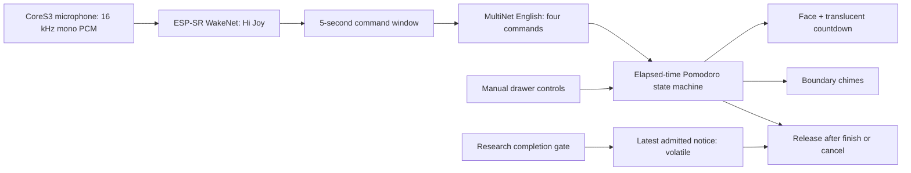

# Hi Joy Pomodoro

Local command interface for one **20-minute focus + 5-minute rest** cycle. No LLM, cloud account or API key is needed. The timer works without the Mac or Wi-Fi after installation.

Say **Hi Joy**, wait for “Hi JY. What can I help you?”, then say **Pomodoro**, **pause**, **resume** or **cancel** within five seconds after the prompt finishes. Repeat-start preserves the running or paused session. Cancel and the end of rest return to the normal face. Reboot discards the session.

The translucent bottom strip shows the countdown. Open the normal drawer for Pomodoro, Pause / resume, Cancel timer and Mute Hi Joy. Mute affects recognition, not the timer.

## Install on M5StackChan CoreS3

From `firmware/`:

```bash
source ~/.local/share/xs-dev-export.sh
export PATH="$HOME/.espressif/python_env/idf6.1_py3.14_env/bin:$PATH"
npm run voice:prepare
npm run build:joy-voice
npm run flash:joy-voice -- --port /dev/cu.usbmodem101
npm run mod -- mods/research_companion/manifest.local.json --port /dev/cu.usbmodem101
```

Use `mods/research_companion/manifest.json` if no research companion configuration exists. Its drawer timer works independently of the research service. Keep private tokens in the ignored local manifest.

`voice:prepare` downloads model files pinned by commit and SHA-256 into generated `dist/voice-models`. The opt-in host embeds them as a resource; existing flash partitions are retained. The normal host remains available through the existing build commands. Generated model data is not committed.

## Architecture



The adapter accumulates one PCM frame at a time; the native worker holds at most 64 copied frames in PSRAM and yields between inference calls. Recognition ignores input during its own cues, mute and research completion. Capture is restarted after playback. Speech models and microphone ownership are released before face detection/announcement and reopened afterwards. Research presentation yields throughout focus, rest and pause. Completion admission is persisted before queuing; reboot cannot replay the pending notice.

This first adapter feeds quiet-room microphone PCM directly to ESP-SR; acoustic echo cancellation/noise suppression is not enabled. Live recognition accuracy, latency and false activations must pass the MiniSRS acceptance checks before this feature is considered complete. Initialization failure leaves manual controls available.

## Verify

```bash
npm run test:pomodoro
npm run test:research
npm run test:unit
npm run mod:build -- mods/research_companion/manifest.json
```

Specification and live acceptance evidence: [knowledge base](../../../knowledge_base/feat/pomodoro/feature.md).

Models: Espressif ESP-SR 2.5.5; `wn9_hijoy_tts` and experimental `mn7_en` (previously `mn6_en`) plus its required `fst` language graph, source commit `76581015af7075681814627a5bb03d2f3f328f8a`. Espressif model license is included under `host/modules/local-voice/LICENSE.models.txt` and permits use on Espressif products.

With `joyVoice.diagnostics: true`, startup tests Espressif’s reference command audio before starting capture. The face overlay reports the reference result, wake/listening status, recognized command candidates, raw PCM peak and per-window dropped frames. It is not a general speech transcript. A reference pass verifies the native recognizer, not live microphone accuracy.

The opt-in voice host uses a 32 KB instruction cache, 64 KB data cache and 64-byte data lines, following Espressif speech example configurations. The standard host keeps its existing defaults. Larger caches consume additional internal RAM; voice and research-camera coexistence still require hardware acceptance. PSRAM type is unchanged; the experimental voice profile selects 80 MHz PSRAM. Hardware stability and recognition throughput remain under test.

The MultiNet7 comparison uses explicit pronunciations generated with Espressif’s `multinet_g2p.py` and `g2p_en` 2.1.0. Resume uses verb-context pronunciation. The optional voice profile selects the matching English SDK command API; native compilation rejects a mismatched selection. Model loading remains at the default for comparison. Direct probes and live/negative tests must pass before accepting this change.
