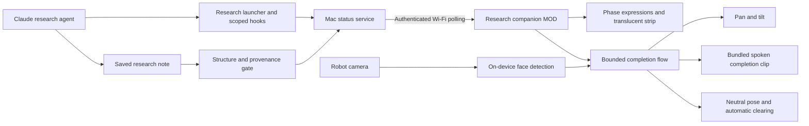

# Architecture overview

Updated 2026-10-04. Delivered research companion baseline: `de40965e` on `jyos-stackchan`.

## Delivered research companion

The Mac runs research, correlates tasks and publishes status. Research-scoped events drive planning, gathering, comparing and drafting expressions. The saved-note gate checks structure and provenance; it does not establish factual accuracy or human review.

The robot runs the opt-in local-completion host and research MOD. Completion tilts upward to 45°, searches within bounded motion limits, attempts face alignment and plays the fixed sentence “JY, your research note is ready for review.” It returns to neutral, releases servo torque and clears the ready strip approximately 15 seconds after completion and cleanup. Espressif HumanFaceDetect runs on the robot; camera images stay on the robot. Face location does not identify a person.

Runtime requires power, Wi-Fi and an awake, reachable Mac. USB is used for deployment and diagnostics. Bearer-authenticated HTTP is unencrypted and intended for a trusted LAN. Persisted completion identifiers limit replay; an interrupted completion attempt can be skipped rather than repeated.

The shared flow framework supports independently triggered flows. Research is integrated; the timer example is display-only, not a scheduler.

Current specification and evidence:

- [Feature specification](feat/research-companion/feature.md)
- [Detailed design](feat/research-companion/design.md)
- [Acceptance evidence](feat/research-companion/acceptance.md)
- [Flow lifecycle](feat/research-companion/flow-lifecycle.md)

## Proposed next capabilities

Acknowledgement, requests for more detail, spoken questions, contextual LLM reactions and further JYOS agent integrations remain proposals. The completion clip is fixed audio, not conversational speech. The current flow does not capture a user's response or create a follow-up Inbox note.

Each independently triggered user-facing module should have its own [feature documentation](feat/README.md): requirements, design, acceptance evidence and progress. Shared infrastructure should be documented once and linked from features.

## Historical greeting-stage model

The earlier `jyos_hello` MOD demonstrated a displayed greeting and direct servo poses. Its [CONSENS-inspired system model](../firmware/mods/jyos_hello/SYSTEM_MODEL.md) records the 2026-10-03 checkpoint. Its status labels describe that checkpoint, not the current research deployment.
