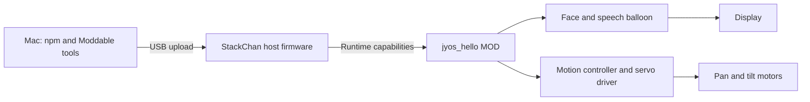
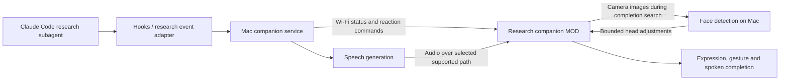

# Architecture overview

## Current, verified system

The greeting is displayed text, not spoken audio. Direct poses use radians; `lookAt()` only triggers head movement above a 30-degree gaze threshold. Virtual A/B/C buttons are disabled on this target.

Detailed environment, functional, structural, behavioral, and requirement views: [system model](../firmware/mods/jyos_hello/SYSTEM_MODEL.md).

## Research companion: implementation and roadmap

The Mac HTTP status service and robot polling MOD are implemented and authenticated Wi-Fi polling has been observed. Claude events, speech, camera processing, and face tracking in the roadmap below remain planned. [Feature design](feat/research-companion/design.md) contains the implemented protocol sequence.

The Mac service owns task correlation, connection recovery, and completion deduplication. Optional LLM reactions select from approved expressions/gestures and use real supplied progress. Firmware executes bounded commands. Transport, audio path, camera transfer, and input mapping require design and hardware verification.

Feature scope and acceptance criteria: [research companion](feat/research-companion/README.md).
