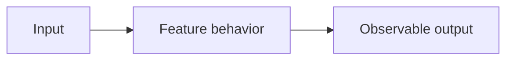

# Design: <name>

## Architecture

Replace this placeholder with the feature's components and interfaces.

## Interfaces and behavior

Document event contracts, units, ownership, lifecycle, and recovery behavior.

## Decisions

| Decision | Reason | Alternatives / limitations |
| --- | --- | --- |
| Pending | Pending | Pending |

## Open questions

List unresolved choices and how to resolve them.
