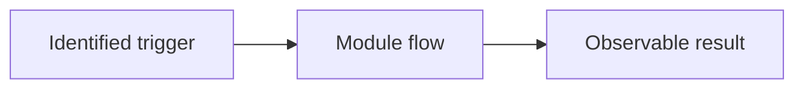

# FEATURE NAME Feature Specification

Explain the user outcome, trigger and successful end state in one paragraph. This file is the canonical specification; exports are derived views.

## Feature record

| Field | Value |
| --- | --- |
| Feature ID | folder-name |
| Lifecycle | Proposed |
| Publication | Not committed |
| Code baseline | Not established |
| Hardware | To define |
| Entry module | To define |
| Dependencies | To define |
| Tracking | Issue and PR links when created |
| Release impact | To assess |

## User experience

Describe the exact trigger, visible stages and end state. Distinguish implemented, planned and observed behaviour.

## Architecture

List component ownership and dependencies. Document shared interfaces rather than copying shared implementation details into each feature.

## Lifecycle and requirements

Give stable requirement IDs. Cover success, cancellation, failure, bounded cleanup, ownership and replay behaviour when relevant.

## Interfaces and persistence

Describe inputs, outputs, identifiers, event ordering, authentication and storage. Do not include credentials or private payloads.

## Operating the feature

Include exact start, inspect, build, deploy and rollback commands that apply. Link to shared setup instructions.

## Acceptance and evidence

Link requirements to observable checks, tested revisions and hardware. Separate automated checks, device diagnostics and human observations. Record gaps without claiming unperformed verification.

## Limits and future work

State operational limits and deferred capabilities. A proposed extension is not an implementation commitment.

## Documentation and change ownership

Update this specification and supporting records with behaviour changes. Regenerate exports after editing Markdown.

## Sources and supporting records

Link design.md, acceptance.md, progress.md, code revisions, issues and PRs. Keep sources identifiable and current.
