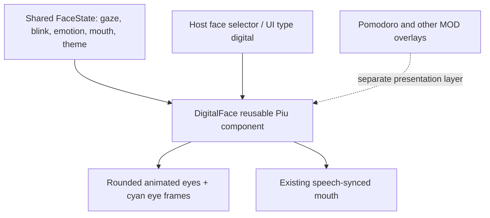

# Digital face design

`DigitalFace` is defined alongside the existing face constructors and composed from the existing `Eye` and `Mouth` parts plus the small `DigitalEyeFrame` primitive. The eye shape responds to the shared face state, including gaze and eyelid animation. The `DOUBTFUL` emotion adds a slight focused squint; other emotion and blink behavior stays connected to the shared state. The frame supplies the cyan digital accent. The mouth remains speech-driven. All parts live within the normal face container, so the existing FaceView can resize, replace, pause, rehydrate and update it.

The style is the default on large-screen UIs, selectable through the normal face drawer, and can be constructed by the host UI registry under `ui.type: digital`. Compact targets configured as `small-face` retain their smaller layout. Feature overlays remain separate Piu effects, so Pomodoro, research status and later modules can coexist with the same face component.

## Follow-up visual review

Check the eye-to-mouth balance on the 320×240 CoreS3 screen, how much of the face remains visible behind the larger focus timer, and whether a dedicated focus expression is needed beyond the shared emotion states. Tune layout only after viewing it on device.
