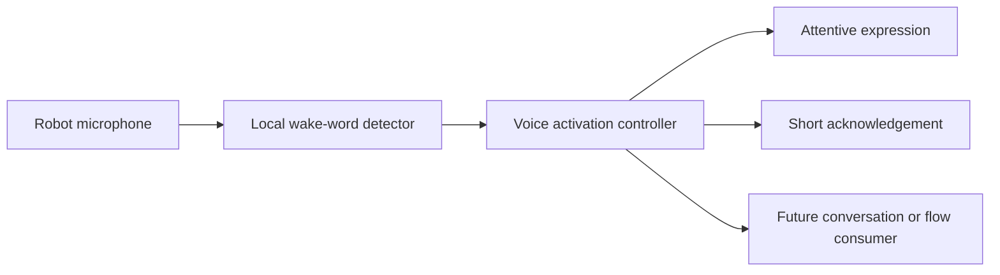

# Hi Joy voice activation — MiniSRS

Draft 0.1 · 2026-10-04 · Specification discussion only.

> Current direction: shared Hi Joy activation will first serve the [Pomodoro feature](../pomodoro/feature.md). The broader conversation, LLM/provider and Inbox plans below are historical proposals deferred for now. Earlier generic acknowledgement/timeout behaviour must be reconciled with wake-followed-by-command recognition before implementation.

## Feature record

| Field | Value |
| --- | --- |
| Feature ID | hi-joy-voice-activation |
| Lifecycle | Proposed |
| Publication | Local draft; not committed or pushed |
| Branch | spec/hi-joy-voice-activation |
| Base | jyos-stackchan; delivered code baseline de40965e |
| Hardware | User's M5StackChan CoreS3 |
| Entry module | Not selected |
| Release impact | Documentation only for this branch; future runtime impact to assess |

## Purpose and agreed scope

The user can get Joy's attention by saying “Hi Joy”. Voice activation is a reusable foundation for future conversations and independently triggered JYOS flows. The user accepted “Hi Joy” instead of requiring “Hey Joy” and requested a specification discussion before development.

The first increment is intended to recognise the phrase, show an attentive expression, acknowledge it and return to standby. Exact acknowledgement, timing and whether to capture a subsequent utterance are still discussion points. No implementation or hardware validation has begun.

## User experience — proposed

Standby detection → wake event → attentive face and short acknowledgement → bounded attention window → standby. Muting disarms wake detection. If a later increment records a spoken request, it must clearly distinguish wake monitoring from active request capture.

## Logical architecture — proposed

Prefer local wake detection. ESP-SR model integration, native bindings, audio ownership and memory/CPU coexistence with existing camera and research capabilities require investigation. Logical components do not prescribe separate packages or a working runtime interface.

## Candidate requirements

All requirements below are proposed until reviewed with the owner. Numbers and thresholds remain TBD rather than assumed acceptance criteria.

| ID | Requirement | Open detail |
| --- | --- | --- |
| HJ-01 | Recognise “Hi Joy” from the robot microphone and emit one activation per accepted utterance. | Distance, noise conditions, detection target |
| HJ-02 | Show an attentive face and provide a short audible acknowledgement after activation. | Phrase or chime; latency target; movement |
| HJ-03 | Return to standby within a bounded interval when no further interaction occurs. | Duration; attention-only versus request capture |
| HJ-04 | Provide a visible mode indicator and a user-operated mute control; muted mode stops microphone capture owned by this feature. | Control mapping; reboot default |
| HJ-05 | Prevent acknowledgement playback from repeatedly activating Joy. | Playback inhibition, cooldown and interruption policy |
| HJ-06 | Coordinate microphone, speaker, face and motion use with other flows without corrupting their lifecycle. | Activation during research or spoken completion |
| HJ-07 | Perform standby detection locally without transmitting or durably saving standby audio. | Model feasibility; transient buffer boundaries |
| HJ-08 | Expose activation to future consumers without embedding research or Workbench logic in the detector. | Event contract; timeout and ownership |
| HJ-09 | Recover from detector/audio failure to a visible, defined state with a usable mute/control path. | Retry policy and failure indicator |

## Interfaces and persistence

### Final conversation goal and selectable providers

Owner direction, 2026-10-04: inspect existing StackChan support first; define modular setup/adapters supporting OpenAI, Gemini, OpenRouter and an owner-deployed LM Studio server. Do not lock Joy to a single provider. Exact default model, speech providers and deployment topology remain open.

The intended final experience is: “Hi Joy” → attentive acknowledgement → spoken request and follow-up conversation → optional JYOS research context and requested Inbox capture → confirmed result → standby. This broader goal is separate from the initial wake-activation increment; research debrief and capture remain independent consumers, not detector responsibilities.

### Capability inventory — inspected, not newly hardware-tested

| Capability | Existing support | Important boundary |
| --- | --- | --- |
| Microphone and playback | CoreS3 audio input/output and runtime audio capability | Hardware capture is not speech recognition |
| Native voice conversation | ChatService + Moddable workers for OpenAI Realtime, Gemini Live, Deepgram, ElevenLabs and Hume | Source support does not prove current account/model compatibility |
| Server-backed voice transport | XiaoZhi v1 connection factory and protocol implementation | Protocol adapter, not an on-device LLM |
| STT | stt-whisper module calls OpenAI transcription endpoint | Remote service; no local full transcription identified |
| TTS | OpenAI, ElevenLabs, VoiceVox, remote audio and local resource playback | Providers have different languages and transport requirements |
| Offline speech synthesis | stackchan-voice on CoreS3; documented Japanese engine and target default | Not a demonstrated general English TTS engine |
| Delivered research audio | Bundled fixed English completion clip | Playback, not dynamic English synthesis |
| Text LLM examples | OpenAI Responses, Gemini generateContent and Claude Messages examples | Hardcoded endpoints and historical example defaults need review |
| On-device conversational LLM | None identified in inspected firmware | Factory AI Agent features do not establish locally hosted model weights |

Local evidence: [conversation API](../../../firmware/host/modules/conversation/chat.ts), [conversation guide](../../../firmware/docs/chat-audioio-integration.md), [STT](../../../firmware/host/modules/audio/stt-whisper.ts), [offline synthesis guide](../../../firmware/docs/stackchan-voice.md), [provider examples](../../../firmware/mods/examples/provider-dialogues/). The installed Moddable SDK also contains the named native voice workers. An older text-to-speech guide says offline on-demand TTS is unavailable; the current stackchan-voice implementation and dedicated guide supersede that statement for Japanese synthesis.

### Required adapter model — specification direction

Support two pipeline categories behind common session behaviour:

1. **Native voice:** provider handles audio input and output; separate STT/TTS calls are not required. Optional transcripts are distinct from durable capture.
2. **Composed voice:** independently select STT, text LLM and TTS. This permits a local LM Studio LLM alongside separately configured speech services.

Wake detection and a fixed acknowledgement do not require STT or an LLM. Native voice transport must not be treated as interchangeable with an OpenAI-compatible text HTTP endpoint.

| ID | Requirement |
| --- | --- |
| VC-01 | Select provider, pipeline category, endpoint, model and credential reference through setup rather than feature-specific hardcoding. |
| VC-02 | Define support targets for OpenAI, Gemini, OpenRouter and LM Studio; expose unsupported capabilities rather than assuming parity. |
| VC-03 | In composed mode, configure STT, LLM and TTS independently. |
| VC-04 | Adapters declare supported streaming, audio formats, transcripts, tools and cancellation; session behaviour adapts or rejects incompatible configurations. |
| VC-05 | Keep provider selection independent of wake detection, research flow and Inbox capture. |
| VC-06 | Do not silently switch local conversations to a cloud provider on failure. |

These are final-system requirements to refine and validate; they do not imply all adapters already exist or belong in the first wake increment. Proposed configuration fields: profile name, mode, provider, base URL, model ID, credential reference, voice/language, capability set, timeout and cost policy. No secrets belong in specifications or firmware MOD source.

Proposed ownership: robot handles wake detection and audio interaction; Mac manages adapters, provider sessions, credentials, permitted JYOS context and validated tool execution. Existing direct robot-to-provider transports are reusable alternatives; final topology remains a design decision. A model may request Inbox capture, but the writer validates scope and reports actual persistence.

### Provider sources and unresolved choices

### Cost and existing subscriptions — discussion evidence

Owner currently has ChatGPT Plus and a personal Claude Code subscription and wants to understand whether additional services are necessary. Do not assume permission to enable paid usage or automatic top-ups.

- ChatGPT subscription and ordinary OpenAI API billing are separate. [Billing documentation](https://help.openai.com/en/articles/8156167-invoice-dates-for-chatgpt-and-api-billing).
- Direct Claude API usage is separate from a Claude subscription. However, the current Agent SDK guidance's June 15 update says Agent SDK and `claude -p` usage still draw from subscription limits; its older monthly-credit proposal is explicitly paused. A Mac-side subscription-authenticated Claude Agent SDK adapter is therefore an additional candidate, subject to account eligibility, latency and integration validation. [Current SDK plan guidance](https://support.claude.com/en/articles/15036540-use-the-claude-agent-sdk-with-your-claude-plan).
- A local LM Studio LLM with local STT/TTS is another candidate avoiding metered cloud inference; selected software/model licences and hardware performance still require evaluation.
- The factory AI Agent provided the owner's earlier question-answering experience, but no retained factory-service integration is established in the current research deployment. Source inspection shows the research MOD does not start ChatService. Factory service entitlement, model identity and reuse through custom firmware remain unverified; do not promise free or transferable access.

Proposed cost goal: provide a path using existing subscriptions or local models before requiring additional metered services. Exact budget and selected path remain owner decisions. No paid accounts or API sessions have been enabled.

- [OpenAI Realtime](https://developers.openai.com/api/docs/models/gpt-realtime) and [WebSocket guide](https://developers.openai.com/api/docs/guides/voice-websockets).
- [Gemini Live](https://ai.google.dev/gemini-api/docs/live-api).
- [OpenRouter API](https://openrouter.ai/docs/api_reference/overview): compatible request surface; audio and tools depend on selected models/endpoints.
- [LM Studio compatibility endpoints](https://lmstudio.ai/docs/developer/openai-compat): configurable local text inference; this does not establish Realtime voice or STT/TTS endpoint equivalence.
- [Factory guide](https://docs.m5stack.com/en/StackChan): app-configurable AI model, voice and recognition; not proof of on-device LLM inference or arbitrary API endpoint selection.

Sources inspected 2026-10-04. No default provider approved or configured. Open choices include languages, responsiveness/interruption targets, local versus cloud speech, profile switching, API budget and unavailable-provider behaviour. Exact model IDs are configuration choices to verify at integration time.

Proposed output: activation event carrying event identity, source and detection time; exact schema not yet agreed. Confidence is optional only if meaningfully exposed by the engine. Consumers must not infer user identity from a wake word or face location.

No durable raw audio or transcript storage is proposed for this increment. Mute preference persistence and automatic rearming after reboot remain open. No external AI provider or network speech pipeline has been selected.

## Acceptance and evidence

See [acceptance.md](acceptance.md). All tests are unperformed. Agree measurable positive and negative recognition checks before declaring the specification ready for implementation.

## Deferred scope

Free-form conversation, research debrief, user identification, Inbox capture, full transcripts, arbitrary custom wake-word training and general voice-controlled actions. These can consume the shared activation capability in later increments.

## Discussion agenda

1. Attention-only acknowledgement or a short window for one spoken request?
2. Chime or “Yes, JY?”; face-only attention or bounded head movement?
3. Armed on boot or explicitly enabled each session? How should mute be controlled?
4. During research, may Joy be interrupted? During completion speech, should detection pause?
5. What desk distance, noise and response delay should define success?

## Reuse candidates and sources

- [Espressif wake-word list](https://github.com/espressif/esp-sr/blob/master/wakeword_list.md): lists `wn9_hijoy_tts` for “Hi, Joy”; availability in our compatible component revision and recognition quality are unverified.
- [ESP-SR for M5Unified](https://github.com/74th/ESP-SR-For-M5Unified): CoreS3 examples; Arduino reference requiring adaptation, not a drop-in Moddable MOD.
- [Factory guide](https://docs.m5stack.com/en/StackChan): factory “Hi, StackChan” behaviour; not the currently installed community firmware.
- [Existing conversation guide](../../../firmware/docs/chat-audioio-integration.md) and [chat example](../../../firmware/mods/examples/chat_audioio/mod.js): reusable conversation interfaces; wake notification alone is not a detector.

External sources inspected 2026-10-04; moving upstream references must be pinned before implementation reuse.

[Design](design.md) · [Acceptance](acceptance.md) · [Progress](progress.md)
