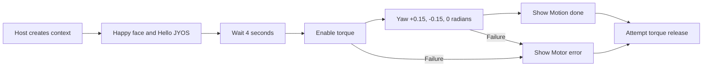

# Design: JYOS hello

Each pose requests a one-second movement followed by a four-second delay. The capability API acknowledges motor commands; it does not independently verify physical arrival. SpeechBalloon is visual text, not speech.

| Decision | Reason |
| --- | --- |
| Separate MOD | Fast iteration without host changes |
| No A/B/C dependency | This target disables virtual buttons |
| Direct `setPose()` | Small gaze targets do not exceed `lookAt()`'s 30-degree threshold |
| Limited three-step sequence | Easy to observe and avoids indefinite motor motion |
| Release torque in `finally` | Attempt cleanup after either success or failure |

See the [system model](../../../firmware/mods/jyos_hello/SYSTEM_MODEL.md) for broader architecture.
