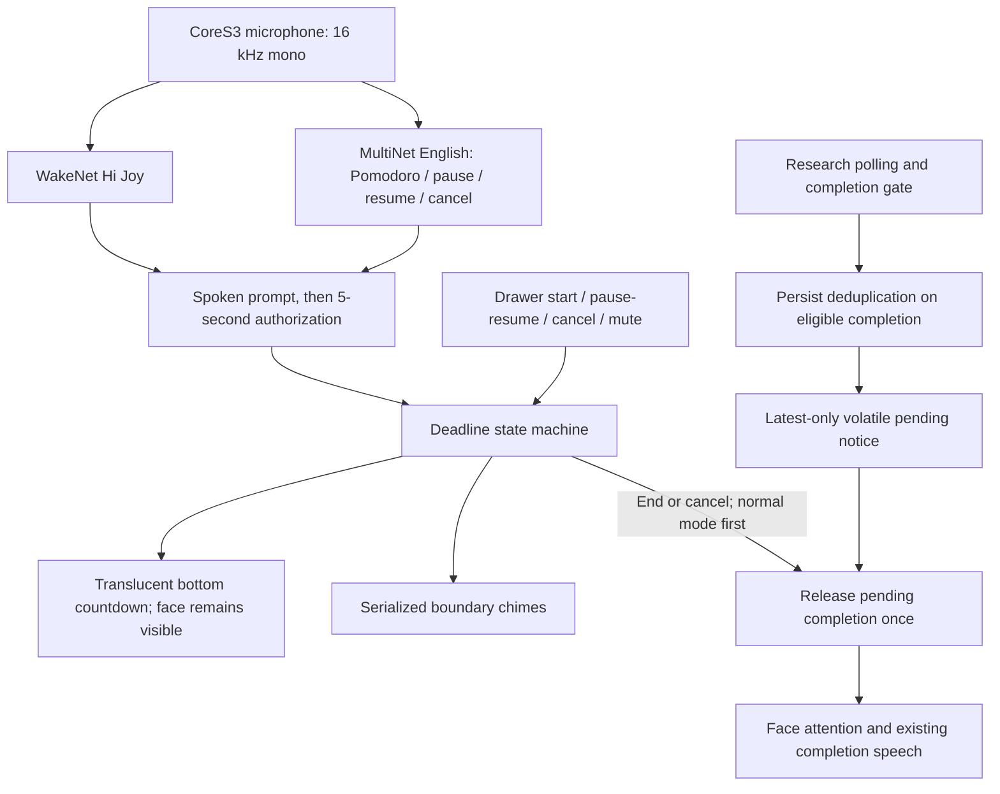

# Pomodoro implementation design

The owner selected a bounded command interaction instead of a general voice/LLM pipeline. The [MiniSRS](feature.md) defines the agreed behavior. Implementation is modular and keeps recognition separate from elapsed-time timer logic.

## Components and resource ownership

- `firmware/mods/pomodoro/timer.js`: pure deadline logic; pause freezes remaining time, resume creates a new deadline, delayed ticks cross boundaries without drift. A new instance always starts idle.
- `command-window.js`: recognition policy. Bare commands, unknown speech, expired authorization and muted/suspended input cannot change the timer.
- `voice-adapter.js`: bounded PCM accumulation and adapter to the optional native engine. Inference runs in a dedicated native worker with a 64-frame PSRAM queue (2.048 seconds maximum at 16 kHz), with a one-tick yield between inference calls; the UI callback submits copied frames without waiting. Generation guards prevent old results crossing command windows. The current quiet-room implementation does not enable ESP-SR AFE noise suppression or acoustic echo cancellation. Own cues stop capture; capture restarts after playback, and command authorization begins after the local greeting finishes. Completion suspends input and releases models before camera inference.
- `host/modules/local-voice`: ESP-SR 2.5.5 native binding, WakeNet `wn9_hijoy_tts`, experimental MultiNet `mn7_en` with explicit command phonemes (previously `mn6_en`), and its required `fst` language graph. The FST asset is checked before model construction; omitting it caused the first startup crash during integration.
- `presentation.js` / `controller.js`: translucent countdown, drawer controls, cues and monotonic tick adaptation. Timer behavior remains available if recognition initialization fails.
- `deferred-completion.js`: eligible research completions are persistently deduplicated when admitted and retained only in memory. The latest supersedes earlier notices. A full session or long pause does not expire an admitted notice; reboot discards it without replay.

Pomodoro owns presentation through focus, rest and pause. Research continues on the Mac and can save results, but its presentation and completion hardware wait. Pomodoro will not start while the existing runner owns completion hardware. Normal completion/cancellation clears the timer strip before releasing the notice.

## Build and deployment

The standard host remains supported. An opt-in `manifest_m5stackchan_cores3_joy_voice.json` includes local completion and speech bindings. `voice:prepare` downloads pinned, SHA-256-verified model files, independently validates the packed resource, and writes generated assets under `firmware/dist`. Models are embedded as a host resource rather than allocating a new flash partition.

The firmware command wrapper seeds managed dependencies before its parallel native compilation and after a manifest-variant clean. The model/license catalog is committed; downloaded weights and binaries are generated and ignored.

## Evidence boundaries

Automated timer, completion admission, binary-resource validation and regression checks pass. Host and MOD flash verification are recorded in [progress](progress.md). Live speech reliability, full-duration timing, chime comfort, display readability and coexistence/reboot checks remain acceptance work; a successful build does not prove these.
