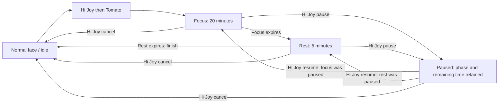

# Voice-controlled Pomodoro — MiniSRS

Specification baseline 0.3 · 2026-10-04 · Owner authorised implementation after readiness review.

## Feature record

| Field | Value |
| --- | --- |
| Feature ID | pomodoro |
| Lifecycle | Implemented; live acceptance in progress |
| Branch | spec/hi-joy-voice-activation |
| Publication | Spec, timer and experimental voice checkpoints pushed; live fixes continue |
| Hardware | User's M5StackChan CoreS3 |
| Dependencies | Shared Hi Joy activation, bounded command recognition, timer, face-preserving UI |
| Release impact | Minor; opt-in CoreS3 voice capability |

## Goal and owner-agreed behaviour

Say “Hi Joy”, then “Tomato”, to start a 20-minute focus phase followed by a 5-minute rest phase. Say “Hi Joy, pause” to pause the whole running Pomodoro. Say “Hi Joy, cancel” to cancel the session and return to normal mode. Say “Hi Joy, resume” to continue a paused session from its retained phase and remaining time. Complete one focus/rest cycle, then return to normal mode; do not repeat automatically. A gentle chime marks the end of focus and another marks the end of rest. Repeating Pomodoro while a session exists, including while paused, preserves its phase, remaining time and paused/running state. During Pomodoro mode the countdown is visible without substantially blocking the face. Research completion speech is deferred until Pomodoro ends.

The conversational LLM/STT/TTS provider plan is deferred at the owner's request. This feature requires a small recognised command set, not an LLM. The opt-in host uses ESP-SR 2.5.5, WakeNet Hi Joy and MultiNet English with four commands. Build and flash verification passed; live voice accuracy remains unproven.

## Lifecycle

Resume retains the paused phase and remaining time; it does not restart that phase. Focus/rest durations on the diagram describe fresh phase entry. While paused, display PAUSED and the frozen countdown. After one cycle, remove the countdown and restore normal mode.

## Requirements

| ID | Requirement | Status |
| --- | --- | --- |
| PM-01 | Accept Hi Joy activation followed by Tomato and start a focus session. | Owner specified |
| PM-02 | Focus lasts 1,200 seconds, then rest lasts 300 seconds. | Owner specified |
| PM-03 | Accept Hi Joy pause during focus or rest; freeze remaining time and phase, including automatic transitions. | Owner confirmed |
| PM-04 | Accept Hi Joy cancel during focus, rest or pause; remove countdown and return to normal mode. | Owner specified |
| PM-05 | Show remaining minutes/seconds and distinguish focus, rest and paused states while preserving face visibility. | Owner specified; layout proposed |
| PM-06 | Use elapsed time rather than decrementing once per UI refresh, so display delays do not extend phases. | Accepted implementation default |
| PM-07 | Repeating Pomodoro during focus, rest or pause must preserve the existing phase, remaining time and paused/running state. Repeated pause/cancel must be safe. | Owner confirmed session preservation; idempotent controls proposed |
| PM-08 | Do not start a phase or alter the timer for unrecognised or incomplete commands. | Proposed |
| PM-09 | Own and release timer/UI resources cleanly; prevent conflicts with research announcements. | Proposed; priority policy open |
| PM-10 | After reboot, discard any running or paused Pomodoro and return directly to normal mode without restoring its countdown. Define mute, recognition failure and manual fallback separately. | Owner confirmed reboot; other policies open |
| PM-11 | Accept Hi Joy resume while paused; continue the retained phase and remaining time without resetting it. | Owner confirmed |
| PM-12 | Finish after one focus/rest cycle, clear Pomodoro UI and return to normal mode without automatic repetition. | Owner confirmed |
| PM-14 | Play a gentle chime when focus completes and another when rest completes; do not replay transition chimes because of display refreshes or repeated commands. | Owner confirmed cues; replay prevention proposed |
| PM-13 | Defer research completion speech throughout the active Pomodoro session, including rest and pause, until the session completes or is cancelled, then release waiting speech after returning to normal mode. | Owner confirmed deferral and cancellation release |

## Display proposal

Use a compact translucent bottom strip showing a small phase icon/label and a legible MM:SS countdown. Retain eyes and mouth as the primary presentation. Paused state shows PAUSED and the frozen remaining time; cancellation and completed rest remove all Pomodoro UI. Gentle phase-transition chimes are agreed; exact dimensions, visual treatment and chime sound/volume remain to review on hardware.

## Architecture and reuse

Separate wake detection, short-command recognition and timer behaviour. Pomodoro consumes command events and owns its phase state and presentation. No general conversation provider is required. A fixed chime or prerecorded cue can acknowledge commands; dynamic speech synthesis is optional, not required.

The existing display-only timer flow is a reuse reference, not an implemented Pomodoro scheduler. Reuse the shared flow framework where its ownership/lifecycle fits; investigate timer coexistence and microphone/audio resource boundaries before choosing runtime integration.

## Deferred research announcement policy

Research may continue and save its results while Pomodoro runs. Completion speech waits through focus, rest and pause; pause does not end the session. Release after normal cycle completion or explicit cancellation is required. On cancellation, clear Pomodoro state/UI and return to normal mode before releasing waiting research speech. Proposed integration should coordinate announcement timing without delaying research execution or interfering with completion replay protection. Pomodoro owns presentation while active. The latest eligible completion is admitted and persistently deduplicated when received, then held in memory until the timer finishes or is cancelled. Reboot discards it. The implementation does not delay the research agent or result saving.

## Reboot policy

Owner confirmed returning directly to normal mode after reboot. Do not restore or resume a previous Pomodoro; remove stale timer state and presentation. This policy does not authorise replaying research completion audio after reboot; recovery of deferred notices remains a separate decision.

## Implementation defaults accepted by proceeding with the plan

- Pomodoro owns its countdown display; research cannot replace it while active.
- Recognition uses a five-second window after Hi Joy, after the locally spoken prompt “Hi JY. What can I help you?” finishes. The owner replaced the wake chime with speech during live testing. Unknown commands expire without changing timer state.
- Touch/drawer controls expose start, pause/resume, cancel and microphone mute. Muting capture does not stop a running timer.
- Deferred notices remain silent after reboot, preserving completion replay protection.
- Defer at most the latest research completion in memory; older pending notices are superseded. Admit a completion through the existing freshness gate when it arrives, persisting its deduplication marker immediately. Keep that admitted notice in volatile memory until normal completion/cancellation, including a long pause. Release once after returning to normal mode. Reboot loses the pending notice and cannot replay it.
- Initial voice acceptance target: at least 9/10 wake-and-command attempts per command at approximately 60 cm in a quiet room, response within two seconds of command completion, and no activation during a ten-minute negative/background test. These are targets, not observed performance.

## Remaining hardware review details

Chime volume, countdown readability, microphone channel/gain, detector thresholds and recognition accuracy require device validation. Failure of a voice target must be reported rather than silently substituting a cloud recogniser.

## Acceptance

[Acceptance matrix](acceptance.md). No recognition, timing, UI or integration tests performed. Final recognition targets, command window and response latency remain TBD.

## Deferred scope

General conversation, model/provider setup, research debrief, Workbench capture, custom durations and statistics. Automatic repetition is outside the agreed scope. Resume is included.

[Design](design.md) · [Progress](progress.md) · [Shared activation](../hi-joy-voice-activation/feature.md)
