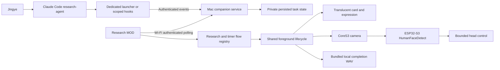

# Research companion architecture

## Context and components



The opt-in CoreS3 host exposes native camera face inference. HumanFaceDetect 0.5.0 runs with ESP-DL 3.3.13; it detects face location, not identity. Camera images remain on-device in the completion window. Mac Vision/audio helpers remain available for the earlier baseline; this MOD does not call them.

## Research result gate

The direct launcher requires successful Claude exit/result, successful source activity and output Write, a new contained Workbench Markdown file, and valid ResearchNote metadata/review sections. Interactive hooks correlate exact `research-agent` session/agent identities, observe a new file before and after Write, and require an explicit successful completion marker plus the same metadata validation. Neither global Claude Stop nor unrelated web activity starts a flow.

Source metadata validation checks HTTPS provenance and optional launcher host restrictions. It cannot verify factual truth, whether every claim is supported, or compliance with every semantic instruction. Notes remain working drafts with Wiki ingestion disabled.

```mermaid
sequenceDiagram
  participant Agent as Research agent
  participant Adapter as Scoped adapter
  participant Service as Mac service
  participant Robot as Robot flow
  Agent->>Adapter: Identified start and actual tool activity
  Adapter->>Service: Ordered progress events
  Service->>Service: Persist before acknowledging/publishing
  Robot->>Service: Poll snapshot every 2 seconds
  Agent->>Adapter: Successful new note save/result
  Adapter->>Adapter: Validate output and provenance
  Adapter->>Service: Ready, or failed if checks fail
  Robot->>Robot: Consume completion ID before effects
  Robot->>Robot: Tilt 45 degrees; bounded face alignment
  Robot->>Robot: Speak; neutral return; release torque
  Robot->>Robot: Clear card 15 seconds later
```

## Transport and ownership

One active task is accepted. Events carry version, taskId, optional flowId, increasing sequence, phase and optional text (80 characters maximum). New tasks start at sequence 1 with confirming/gathering. Exact retries are duplicates; stale/conflicting/retired/busy events are rejected. Accepted snapshots and up to 128 task IDs persist beside the private config. Persistence failure leaves the previous published state intact.

One foreground runner owns presentation and hardware until cleanup finishes. Camera, motion and audio callbacks carry generation guards. The robot records the last 16 consumed completion IDs before effects and requires observing an active task within five minutes before accepting ready. This is bounded at-most-once attempts, not guaranteed delivery: offline or interrupted announcements can be skipped.

HTTP bearer authentication is intended for a trusted LAN without port forwarding. It is not encrypted. Status transport contains brief messages, not research-note contents. Diagnostics contain stages rather than images.

## Physical limits

Completion tilts to 45 degrees, searches for up to eight seconds, confirms two consistent detections and adjusts yaw within ±30 degrees, at most 10 degrees per step. The largest face is selected. Tested upright faces around 60 cm away gave positive centered and off-center alignment; close, sideways faces previously failed. No face or unavailable camera still leads to the completion cue. Motion/audio have outer deadlines; neutral return includes settling before torque release.

The sentence is a finite bundled three-second WAV, not arbitrary on-device TTS. LLM-generated reactions, continuous tracking, identity recognition, encrypted transport and queued delivery remain future features.
