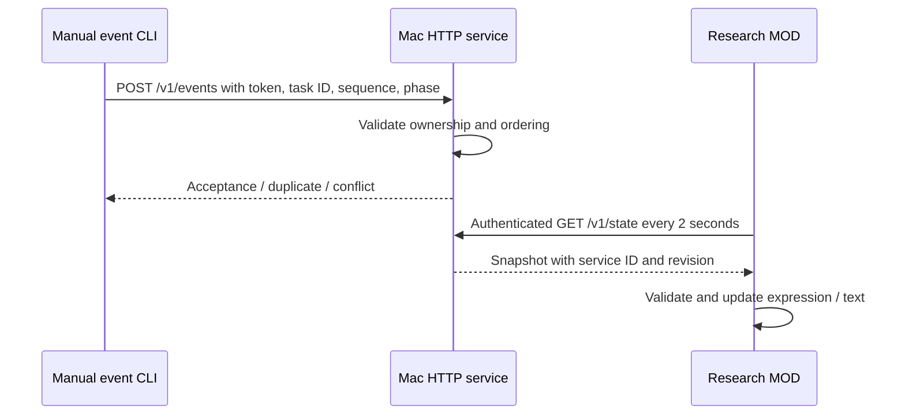
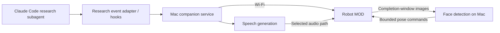
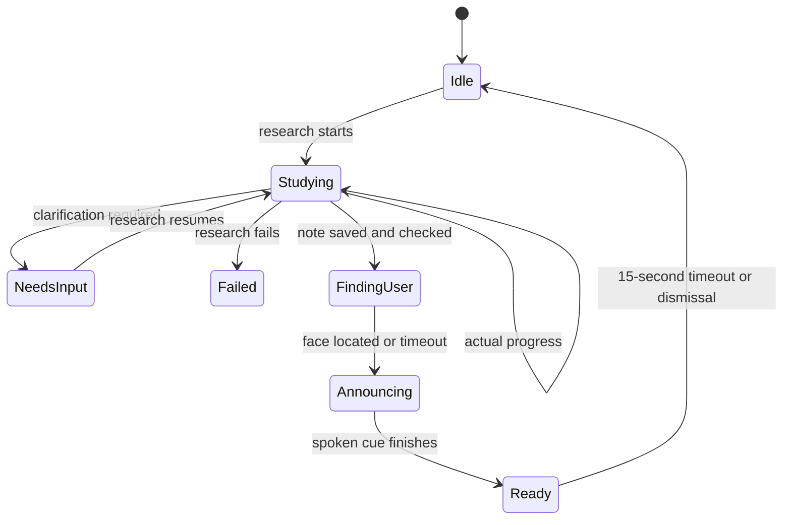

# Design: Research companion

The required next architecture is specified in [modular flow lifecycle](flow-lifecycle.md): start only for an identified research-agent run, detect/turn toward a face before announcing completion, then clear the ready card after a configurable interval. Shared flow runner and hardware adapters support future independent flows. The defaults proposed are an 8-second face-search deadline and 15-second ready-card lifetime after speech.

The Wi-Fi/status foundation and completion modules are implemented. The completion path starts the robot camera explicitly, sends RGB565 frames to a local Apple Vision detector, makes bounded horizontal face-directed adjustments, plays a locally generated completion WAV, then hides the ready card after fifteen seconds. Robot diagnostics confirmed repeated captures, speech playback completion and clearing after a native-buffer upload correction. Positive face detection and motion direction remain to be confirmed on hardware. Automatic Claude hooks remain pending; prior real research tests used a temporary external runner.

## Implemented first increment

The service listens on port 8787 (localhost by default, explicit LAN binding for robot use). This is a trusted-LAN HTTP prototype, not an encrypted channel. Private local manifest stores the Mac address/shared token and is ignored by Git. Failed polls show disconnection; the next valid poll restores display even if its revision is unchanged. A 3-second request timeout bounds stalled polls; the poll period adds up to 2 seconds before detection.

Only one active task is accepted. A new ID starts at sequence 1 with confirming/gathering, after idle or a terminal ready/failed state. Exact retries do not advance revision; stale/conflicting events and retired tasks are rejected. The service retains up to 128 task IDs without eviction and has no persistence; service restart creates a fresh session. The robot suppresses duplicate snapshot application within its current boot/session. None of this yet guarantees once-only speech across restarts.

`ready` is currently submitted by the manual CLI or the temporary research-test runner. That runner checks the newly saved note before emitting it; a reusable installed Claude integration remains pending. There is no inference from global Claude Stop hooks.

## Architecture

## State and event contract

### Status card

The MOD now uses a 304-pixel-wide bottom card instead of the small speech balloon. Dark slate background, 24px Open Sans phase heading, 16px supporting text, and cyan/green/error accents provide a clear hierarchy. Four stage markers represent gathering, comparing, drafting, and ready; they are not percentage estimates. Long custom text is shortened to fit, while the Mac snapshot retains the full text. The face remains behind the card; overlap/readability require on-device visual confirmation.

Proposed event fields: task ID, sequence/event ID, timestamp, phase, optional concise status, and result-note reference. Phases: confirming, gathering, comparing, drafting, ready, needs-input, failed. Connection state is tracked separately.

Use explicit research milestones where possible. Tool hooks can supplement searching/fetching indications but cannot determine every semantic phase. Claude `Stop` means a response ended, and `SubagentStop` means a subagent stopped; neither alone proves the research succeeded. Correlate the intended agent with the expected saved ResearchNote and agreed validation.

The research agent's allowed tools exclude shell execution and its writing scope is limited to a new ResearchNote. Place notification plumbing in an external adapter/hook/service rather than expanding its authority implicitly.

## Completion behavior

Suggested announcement: **“JY, your research note is ready for review.”** Never imply human verification or Wiki publication. Keep spoken progress optional; completion speech is requested.

## Decisions and open questions

| Topic | Direction / unresolved detail |
| --- | --- |
| Task ownership | One active research task initially; Mac service handles IDs and deduplication |
| Wi-Fi transport | Increment A: robot polls Mac HTTP snapshots with shared bearer token; event POST acknowledged by service. TLS and durable completion handling remain future design work |
| Speech | Prefer Mac-side generation; validate supported playback path before choosing provider |
| Implemented speech | macOS Samantha generates a canonical mono 8kHz WAV under ignored dist; robot fetches it with bearer authentication and calls audio.playAudio |
| Vision | Detect a face without identity recognition; short completion-only window; no image retention by default |
| Implemented vision | Apple Vision on Mac; fixed 176×144 RGB565LE; tries upright/rotated orientations; two consistent detections; yaw clamped to ±0.15 radians |
| Motion | Bounded, slow adjustments; horizontal tracking first; tested limits before scanning |
| No face found | Timeout, return forward, announce once anyway |
| LLM | Optional contextual text/approved reaction selection; no arbitrary motor commands or invented progress |
| Failures | Robot unavailable must not block research; audio failure should retain visual ready status |
| Implemented cleanup | Camera stopped before audio; neutral pose then torque release; ready card hides after 15 seconds; last 16 attempted completion IDs persisted to robot preferences |

## References

- [Claude Code hooks](https://code.claude.com/docs/en/hooks).
- Local research specifications and boundaries: [repository context](../../repository.md).
- [System model](../../../firmware/mods/jyos_hello/SYSTEM_MODEL.md).
