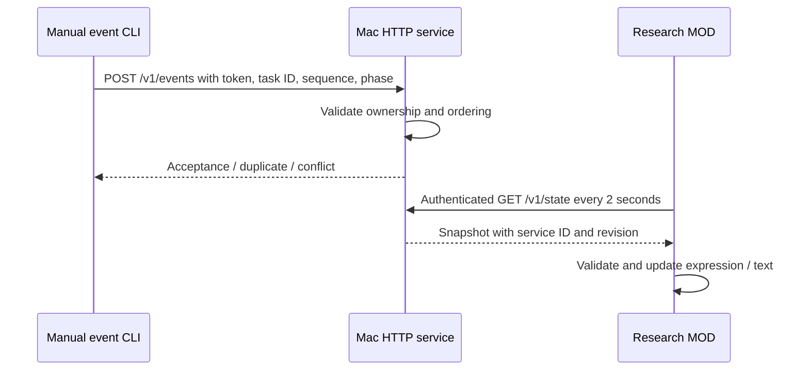
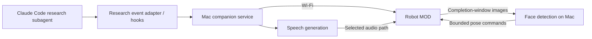
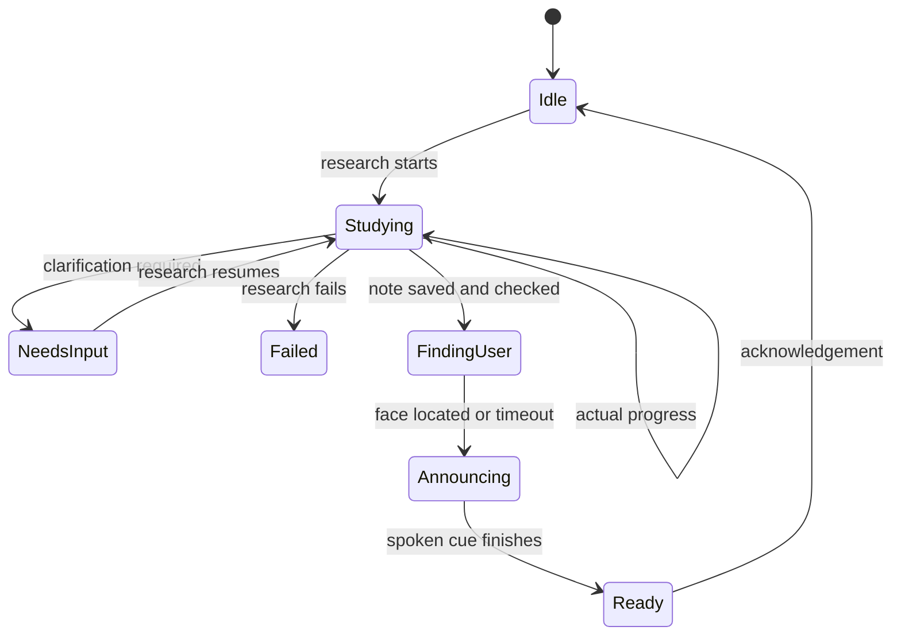

# Design: Research companion

The Wi-Fi/status foundation is implemented. Authenticated robot polls reached the Mac service, and the user observed Finding sources on-screen. Claude integration, speech, camera capture, and face tracking below remain proposed; other screen transitions and reconnect behavior still need hardware observation.

## Implemented first increment

The service listens on port 8787 (localhost by default, explicit LAN binding for robot use). This is a trusted-LAN HTTP prototype, not an encrypted channel. Private local manifest stores the Mac address/shared token and is ignored by Git. Failed polls show disconnection; the next valid poll restores display even if its revision is unchanged. A 3-second request timeout bounds stalled polls; the poll period adds up to 2 seconds before detection.

Only one active task is accepted. A new ID starts at sequence 1 with confirming/gathering, after idle or a terminal ready/failed state. Exact retries do not advance revision; stale/conflicting events and retired tasks are rejected. The service retains up to 128 task IDs without eviction and has no persistence; service restart creates a fresh session. The robot suppresses duplicate snapshot application within its current boot/session. None of this yet guarantees once-only speech across restarts.

`ready` is currently an explicitly submitted test/manual status. The future research adapter must verify the saved note before emitting it. There is no inference from Claude hooks in this increment.

## Architecture

## State and event contract

Proposed event fields: task ID, sequence/event ID, timestamp, phase, optional concise status, and result-note reference. Phases: confirming, gathering, comparing, drafting, ready, needs-input, failed. Connection state is tracked separately.

Use explicit research milestones where possible. Tool hooks can supplement searching/fetching indications but cannot determine every semantic phase. Claude `Stop` means a response ended, and `SubagentStop` means a subagent stopped; neither alone proves the research succeeded. Correlate the intended agent with the expected saved ResearchNote and agreed validation.

The research agent's allowed tools exclude shell execution and its writing scope is limited to a new ResearchNote. Place notification plumbing in an external adapter/hook/service rather than expanding its authority implicitly.

## Completion behavior

Suggested announcement: **“JY, your research note is ready for review.”** Never imply human verification or Wiki publication. Keep spoken progress optional; completion speech is requested.

## Decisions and open questions

| Topic | Direction / unresolved detail |
| --- | --- |
| Task ownership | One active research task initially; Mac service handles IDs and deduplication |
| Wi-Fi transport | Increment A: robot polls Mac HTTP snapshots with shared bearer token; event POST acknowledged by service. TLS and durable completion handling remain future design work |
| Speech | Prefer Mac-side generation; validate supported playback path before choosing provider |
| Vision | Detect a face without identity recognition; short completion-only window; no image retention by default |
| Motion | Bounded, slow adjustments; horizontal tracking first; tested limits before scanning |
| No face found | Timeout, return forward, announce once anyway |
| LLM | Optional contextual text/approved reaction selection; no arbitrary motor commands or invented progress |
| Failures | Robot unavailable must not block research; audio failure should retain visual ready status |

## References

- [Claude Code hooks](https://code.claude.com/docs/en/hooks).
- Local research specifications and boundaries: [repository context](../../repository.md).
- [System model](../../../firmware/mods/jyos_hello/SYSTEM_MODEL.md).
