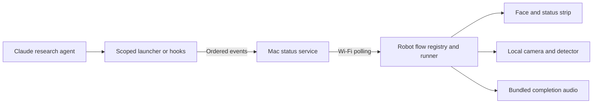
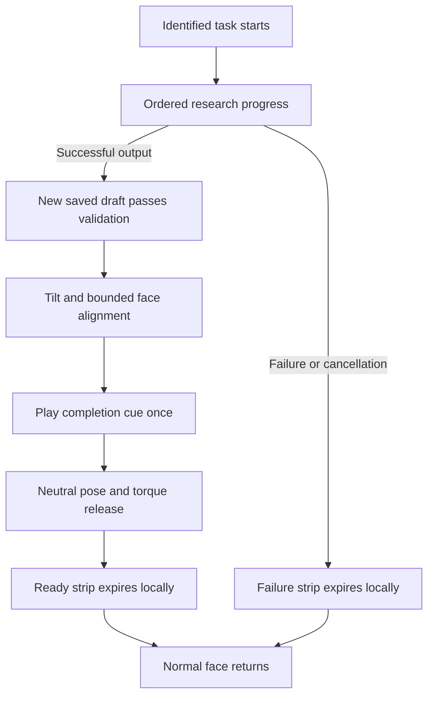

# StackChan Research Companion Feature Specification

StackChan shows the progress of an identified Claude research task, then announces that a saved draft is ready for review. The Mac runs research and status transport; the robot handles the visible reaction, bounded face alignment and fixed completion audio locally.

This document describes the delivered feature and its operating limits. Use the linked design and acceptance records for implementation detail and historical evidence. The canonical document is this Markdown file; HTML and Word exports are derived views and must be regenerated after edits.

## Feature record

| Field | Value |
| --- | --- |
| Feature ID | research-companion |
| Lifecycle | Complete |
| Publication | Merged into jyos-stackchan on 2026-10-04 |
| Code baseline | de40965e3cfcf6cad30a03e726732abd1036d094 |
| Hardware | Kickstarter complete M5StackChan CoreS3 |
| Entry module | firmware/mods/research_companion |
| Host capability | Opt-in CoreS3 local completion host |
| Tracking | Issue 1; PR 3 merged before PR 2 |
| Release impact | Minor for the delivered feature; documentation updates alone have no release impact |

## User experience

Only a deliberately identified research run starts the flow. The dedicated launcher and scoped Claude hooks observe actual work. Unrelated agent stops and web activity do not trigger the robot.

| Phase | Visible behaviour |
| --- | --- |
| Planning | Thoughtful gaze with lightly narrowed eyes |
| Finding sources | Attentive eyes with brief blinks |
| Comparing evidence | Inquisitive expression with a slight asymmetric squint |
| Writing a note | Focused expression with both eyes gently narrowed |
| Needs input | Doubtful face and a concise prompt |
| Ready | Happy face and the completion sequence |
| Failure or disconnection | A short problem message; no invented success |

A compact translucent strip keeps the face visible. Its markers represent actual phases, not estimated percentages. The head stays still during research.

On success, the head tilts upward by 45 degrees and briefly searches for a face. It performs bounded horizontal corrections, plays the bundled sentence, returns to neutral and releases servo torque. After completion and cleanup, the ready strip remains for about 15 seconds before clearing. No detected face still permits the spoken cue. The detector locates a face; it does not identify the owner.

## Architecture



| Component | Responsibility | Location |
| --- | --- | --- |
| Research adapter | Identify runs and validate new output | tools/research-companion |
| Mac service | Authenticate events and persist task state | tools/research-companion/service.mjs |
| Registry and runner | Select flows and own foreground lifecycle | mods/research_companion/flow-registry.js and flow-runner.js |
| Completion adapter | Bounded camera, motion, audio and cleanup | mods/research_companion/completion.js |
| Native detector | Face inference on ESP32-S3 | host/modules/local-face-detector |
| Presentation | Phase expressions and translucent strip | mods/research_companion/mod.js and status-card.js |

Component paths in the table are relative to `firmware/`. HumanFaceDetect 0.5.0 runs with ESP-DL 3.3.13 in the opt-in host. Completion images remain on the robot. One foreground runner retains hardware ownership until cleanup finishes; generation guards reject stale callbacks.

## Lifecycle and requirements



| Requirement | Contract |
| --- | --- |
| RC01 Trigger scope | Exact research run identity starts the flow; unrelated work is ignored |
| RC02 Progress | Status follows observed source and write activity |
| RC03 Ready gate | Successful execution and a new contained ResearchNote must pass metadata and review-section checks |
| RC04 Attention | Tilt first; search is bounded, yaw stays within 30 degrees each way, and corrections are capped at 10 degrees per step |
| RC05 Announcement | Attempt the fixed cue once for a consumed completion identity |
| RC06 Cleanup | Return to neutral, release torque and clear the ready presentation locally |
| RC07 Recovery | Handle missing faces, unavailable helpers, disconnects and interrupted work without blocking future flows indefinitely |
| RC08 Ownership | A newer flow waits for hardware cleanup; duplicate completion does not repeat effects or extend expiry |

## Interfaces and persistence

The authenticated HTTP service exposes state polling and ordered task events. Events carry protocol version, task ID, flow ID, sequence, phase and an optional short message. Exact retries are duplicates; stale, conflicting, retired or overlapping tasks are rejected. An event acknowledgement confirms service acceptance, not robot rendering.

Configured service state persists before acknowledgement. The robot records consumed completion IDs before effects and requires a recent active observation before announcing ready. This favours avoiding repeated cues, while allowing an interrupted or offline cue to be skipped. It provides bounded at-most-once attempts rather than guaranteed delivery. Service capacity is 128 task IDs; robot replay history retains 16 IDs.

Transport is bearer-authenticated HTTP for a trusted LAN. It is not encrypted. Local tokens and configuration stay outside committed documentation. Research-note contents are not sent as status; camera images are not sent to the Mac by this implementation.

## Operating the feature

The configured robot needs power and Wi-Fi to an awake, reachable Mac. Runtime does not require USB data. From `firmware/`, keep the service running in one terminal:

```bash
npm run research:serve -- --host 0.0.0.0 \
  --config mods/research_companion/manifest.local.json
```

Run research in another terminal, choosing a fresh output filename:

```bash
npm run research:run -- --config mods/research_companion/manifest.local.json \
  --project /Users/yeejingye/workspace/personal/jyos-system \
  --output "/Users/yeejingye/JYOS/Workbench/00 Inbox/Research - NEW TOPIC.md" \
  --question "Your public-source research question"
```

Inspect the service or update the MOD with the already installed host:

```bash
npm run research:state -- --config mods/research_companion/manifest.local.json
source ~/.local/share/xs-dev-export.sh
source ~/.espressif/python_env/idf6.1_py3.14_env/bin/activate
npm run mod -- mods/research_companion/manifest.local.json \
  --port /dev/cu.usbmodem101
```

Confirm the actual serial port before flashing. Native capability changes require a host rebuild. Ordinary MOD changes use the faster MOD cycle. The [developer guide](../../../firmware/mods/research_companion/README.md) includes setup, host deployment, interactive hooks and synthetic test commands.

## Acceptance and evidence

| Evidence layer | Recorded result |
| --- | --- |
| Automated behaviour | 405 firmware unit tests, 36 companion tests and 79 architecture checks passed |
| Target configuration | Manifest preflight passed for six standard targets; this does not prove physical operation on every target |
| Native capability | Positive, blank, invalid-input and detector-lifecycle smoke checks passed |
| Controlled hardware | Upright faces around 60 cm were detected; off-centre alignment converged towards the image centre |
| Human observations | Turning towards the user, one cue, neutral return, clearing and reboot without repeated speech were confirmed |
| Latest visual update | MOD compiled and its flash digest verified; a synthetic phase sequence reported cleared |
| Integrated merge | Both validation runs passed on PR 2 head 3639b76c before merging |

These are recorded results, not tests rerun while authoring this document. The final cleared diagnostic proves cleanup reporting; it does not independently verify every facial expression or positive face alignment. See [acceptance](acceptance.md) for provenance and distinctions between diagnostics and human observations.

## Limits and future work

Face accuracy is established only for the tested desk geometry. The robot selects a face location without identity recognition. Speech is a fixed audio clip rather than arbitrary local text to speech. Status transport depends on the Mac and LAN, and bounded history is not a durable delivery queue.

Ready means a saved draft passed structural and provenance checks. It does not establish factual accuracy, human verification or Wiki publication. The adapters support the public-source ResearchNote profile; private research needs an explicit access policy. The registered timer example demonstrates reuse of the lifecycle, not timer scheduling.

Richer reactions, continuous tracking, arbitrary speech and additional flows are separate future features. They should receive their own feature records and acceptance criteria before implementation.

## Documentation and change ownership

This feature owns the research MOD, adapters, completion integration and presentation contract. Shared helpers remain components with clear interfaces. A future independently triggered MOD or flow gets its own `feat/<feature-id>/feature.md`, linked from the feature index, with dependencies back to shared capabilities.

Update the specification, design, acceptance evidence and progress in the same change as behaviour. Regenerate exports from Markdown rather than editing them directly. The Workbench recap links to this repository record; it does not replace it.

## Sources and supporting records

- [Feature design](design.md), [flow lifecycle](flow-lifecycle.md), [acceptance](acceptance.md) and [progress history](progress.md).
- [Code at the merged baseline](https://github.com/yeejingye/jyos-stackchan/tree/de40965e3cfcf6cad30a03e726732abd1036d094).
- [PR 3](https://github.com/yeejingye/jyos-stackchan/pull/3) merged into the research branch before [PR 2](https://github.com/yeejingye/jyos-stackchan/pull/2) merged into jyos-stackchan on 2026-10-04.
- [Developer guide](../../../firmware/mods/research_companion/README.md) for exact commands and runtime requirements.
