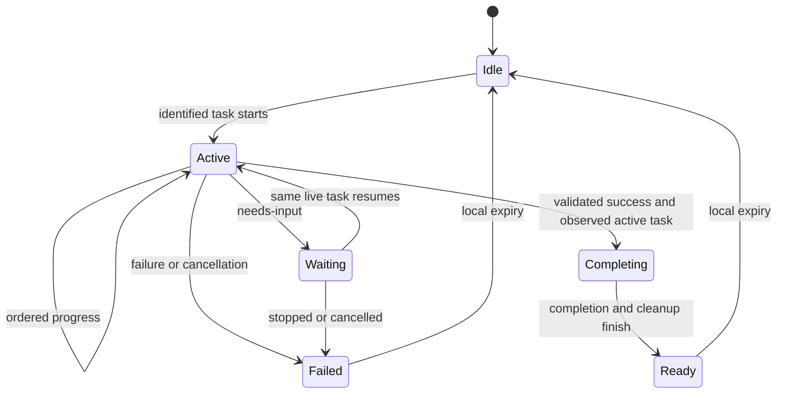

# Modular companion flows

A firmware MOD packages registered behaviors. Each flow supplies display, completion, cleanup and expiry; the shared runner manages ownership, generation guards and dismissal. The poll loop does not contain a separate branch for each feature.

Research completion: 45-degree tilt → bounded local face search/alignment → local spoken cue → neutral pose and torque release → ready card → clear after 15 seconds. A stopped subagent requiring input terminates that adapter run as failed; retry uses a new identity. The protocol can represent needs-input for adapters that remain alive.

Timer demonstration: active card → ready card → clear after five seconds, with no camera, motion or speech. It demonstrates another registered flow, not timer scheduling.

| Module | Responsibility |
| --- | --- |
| Launcher / Claude hooks | Identify research run, track real activity, validate successful new output |
| ResearchState / service | Authentication, ordered events, one active task, persistence |
| FlowRegistry | Select definition; reject unknown flows; preserve foreground ownership |
| FlowRunner | Shared transitions, expiry, generation guards, cancellation |
| CompletionGate | Recent active observation and persisted consumed IDs |
| Research completion adapter | Camera, bounded motion, bundled speech and neutral cleanup |
| Status card | Readable translucent presentation and normal-face restoration |

Duplicate ready events do not extend the expiry or repeat hardware. A cleared card does not change a successful task into failure. A new run cannot take hardware ownership until the preceding cleanup ends. Service loss during active work shows disconnection; a local completion already underway still expires. Reboot consumes no stale ready snapshot that was not observed active in that boot.

To add a flow, register its definition, emit its flowId with ordered task events, and verify observable completion/cleanup behavior. Keep research-note validation in the research adapter and hardware-specific behavior out of the generic runner.

See [acceptance checks](acceptance.md) and [developer commands](../../../firmware/mods/research_companion/README.md).
