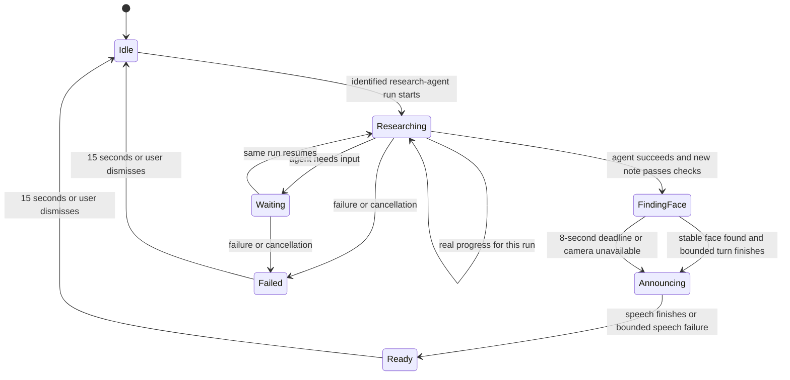
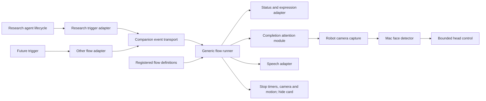

# Modular companion flows

Required behavior agreed on 2026-10-03. Completion modules are now implemented: bounded local face detection/turning, spoken cue and timed clearing. Robot diagnostics confirmed playback completion and clearing after an upload buffer fix; positive face-directed motion still needs hardware confirmation. The real research tests used a temporary wrapper, not an installed automatic agent trigger.

## Research lifecycle

Idle means the normal robot face, with no research card. Connecting to Wi-Fi, starting Claude, running another agent, or receiving unrelated tool activity must not start this flow. Transport may stay connected in the background. Connection errors must not create a research screen while idle.

The completion order is **save/check result → detect face → turn toward face → speak and signal ready → clear → idle**. Suggested speech: “JY, your research note is ready for review.” Ready means saved for review, not human verified or published.

Defaults are configurable: face-search deadline 8 seconds; completion card lifetime 15 seconds after announcement finishes. Speech and motion need their own bounded deadlines. Camera failure, no face, motion failure, or audio failure must still reach cleanup. A visual ready indicator remains the fallback if speech fails. Needs-input stays visible while the run is waiting; a long research task must not be declared complete just because time elapsed.

## Modules and responsibilities

| Module | Owns |
| --- | --- |
| Research trigger adapter | Match research-agent exactly, assign a run ID, correlate progress and saved output, report success/failure/cancel |
| Research flow definition | Allowed phases, research wording/expressions, output validator, completion policy |
| Generic flow runner | Start/update/finish lifecycle, one foreground owner, deadlines, duplicate suppression, cancellation and cleanup |
| Display adapter | Show/update/hide a flow card and release face control on exit |
| Attention module | Short camera window, stable detection, bounded turn, no-face fallback |
| Speech adapter | One announcement per completion, playback outcome and timeout |
| Transport | Authentication, ordering, delivery and device acknowledgements; no research-specific presentation |

A future build, reminder or meeting flow supplies its own trigger adapter and definition. It reuses the runner and hardware adapters. Do not add branches for every new feature to the central poll loop. Keep flow definitions separate from MOD packaging: a firmware MOD is the deployment container; a flow is a registered behavior within it.

## Trigger and event contract

Events should carry `version`, `flowId`, `runId`, increasing `sequence`, `kind` (start/progress/completed/failed/cancelled), and bounded display data. The research adapter supplies a result reference only after validation. Keep private note content off the status transport.

For a delegated Claude research agent, match `SubagentStart`/`SubagentStop` against the exact custom agent type and correlate its agent/session IDs. For a direct `claude --agent research-agent` invocation, use a dedicated launcher with explicit start/exit handling. A research skill needs its own scoped adapter if it does not actually invoke that agent. Do not install a global notification on every Claude Stop or every WebSearch. Confirm the user's usual invocation before installing the applicable integration.

An agent stopping is not sufficient proof of success. Validate the expected new file for this run: allowed path, newly created output, parseable ResearchNote metadata, working maturity, provenance/sources, no invented human verification, and an explicit successful agent outcome. Validation gates readiness, not factual truth. A source-policy violation should be surfaced for review rather than silently described as compliance.

Reference: [Claude Code hook lifecycle and agent matching](https://code.claude.com/docs/en/hooks).

## Ownership and cleanup

- One foreground flow initially. A competing start receives an explicit busy response; never silently overwrite the current run. A bounded queue can be added later as a separate policy.
- New runs have unique IDs. Duplicate completion and unchanged snapshots do not repeat face search, speech, or reset the ready timer.
- Separate research task state from robot presentation state. The saved task can remain completed while the display is idle. Clearing the card must not change a successful task into a failure.
- Persist consumed completion IDs for restart-safe announcement deduplication. Old completed snapshots must not announce on reconnect or reboot. Define an expiry for pending completion delivery when the robot was offline.
- Timer and asynchronous callbacks carry the run identity. Late face/audio/network responses cannot change a newer flow.
- Exit closes captured frames, stops camera acquisition, cancels flow timers/requests, restores eye/expression control, and releases motor ownership. After a bounded neutral return, restore the previous torque state. Do not keep continuous tracking active in idle.
- Connection loss during active work may show a connection status. It does not imply success. A completion already showing locally expires on its own clock even if the Mac disconnects.

## Face search

Use the robot's camera, with detection on the Mac. Send frames only during the completion window; retain no images by default and send none to an external LLM. Detect presence/location, not identity. Prefer a stable central/largest face; multiple people make the target ambiguous. Calling it “your face” describes the intended interaction, not verified identity recognition.

Start with horizontal tracking and the already tested small movement range. Reject stale or invalid detections, smooth jitter, clamp angle/speed, and stop once aligned. Verify camera orientation, mirroring, head direction and actual servo limits on this device before expanding the range. If no face is visible, announce without pretending to have located the user; scanning beyond the tested range is a later option.

## Acceptance checks

1. Normal startup and unrelated Claude activity leave the robot idle.
2. A research-agent run starts exactly one research flow; actual progress drives the display.
3. Missing/invalid output and failure/cancellation never produce a success announcement.
4. A valid completed run detects a visible face, turns toward it, then announces once.
5. No-face/camera/audio failures terminate within their deadlines and still clear the card.
6. Fifteen seconds after announcement, Research ready disappears and the normal face returns.
7. Duplicate events, reconnect and robot/service restart do not replay consumed announcements or revive an expired card.
8. A newer run is unaffected by callbacks/timers from an older run.
9. A second sample flow uses the same runner with a different definition and requires no research-specific changes in the runner.

Current evidence covers real research → saved note → visible ready, plus a corrected synthetic completion that reported camera captures, audio playback completion and clearing. Automatic triggers remain implementation work; audible speech, positive face detection/motion and restart behavior need further hardware verification. The current runner handles shared lifecycle through injected adapters; a general named flow registry/event envelope remains future work. It persists the last sixteen completion attempts and skips ready tasks not observed active, providing bounded at-most-once attempts rather than a durable delivery queue.
